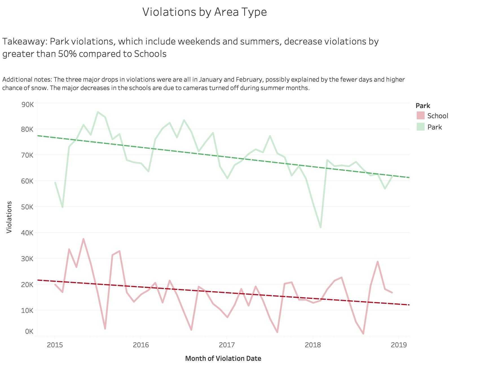

# Chicago-Speed-Violations
Visualizations based on data created from Chicago's speed violations

First attempts:
When I first began, I was working off of my finding that the average camera violations significantly rose durring the summer. Eventually I realized this was due to the number of active cameras dropping each summer and I bagan working with this as my interesting finding. As I investigated, I read the data explanation that included the implementation of the [speed cameras](https://www.chicago.gov/city/en/depts/cdot/supp_info/children_s_safetyzoneporgramautomaticspeedenforcement.html).
This included the explanation that when these cameras were added, the citizens allowed it on the condition that the cameras were turned off on days class did not meet including Saturday, Sunday, and most of the summer. This explained my finding, however it meant that it was in no way interesting and wouldn't be worth the Rahm Emanuel's time.
While this meant I didn't have my visualization, it did lead me on a road to my eventual findings. I decided I could look into the differences between the cameras that were turned off during the weekend, and those that were left on. THis difference would differentiate Parks and Schools. To do this I had to play aroud with the data in excel:
First, I was looking around for was to isolate which weekdays cameras were available. My intial attempt was by downloading a date and day dataset and using VLOOKUP to match days of the week. Then I found I could simply use the function =TEXT([date cell #],"dddd"), creating a new column with the weekdays. Next, I filtered the weekday column by Saturday and Sunday to find the camera IDs that were not associated with schools. I copied the relevent IDs over to a new sheet and removed duplicates. Next to those camera IDs I put a "1". Back on the unfiltered main dataset, I used VLOOKUP on a new column "Park Dummy" and every camera ID that had a weekend at some point, was givin a "1". I fileted and put a "0" under all others. The reason for all these steps was my difficulty in marking park cameras on weekdays. Eventually, I replaced "1" with "Park" and "0" with "School" and I had another insightful column.

Vidualization 1: Violations by Area Type

My visualizans began with playing around with the differences between parks and schools. This quickly led me to my first finding that Park violations were declining more quickly than schools. This made it clear I was on a path for significant findings.
