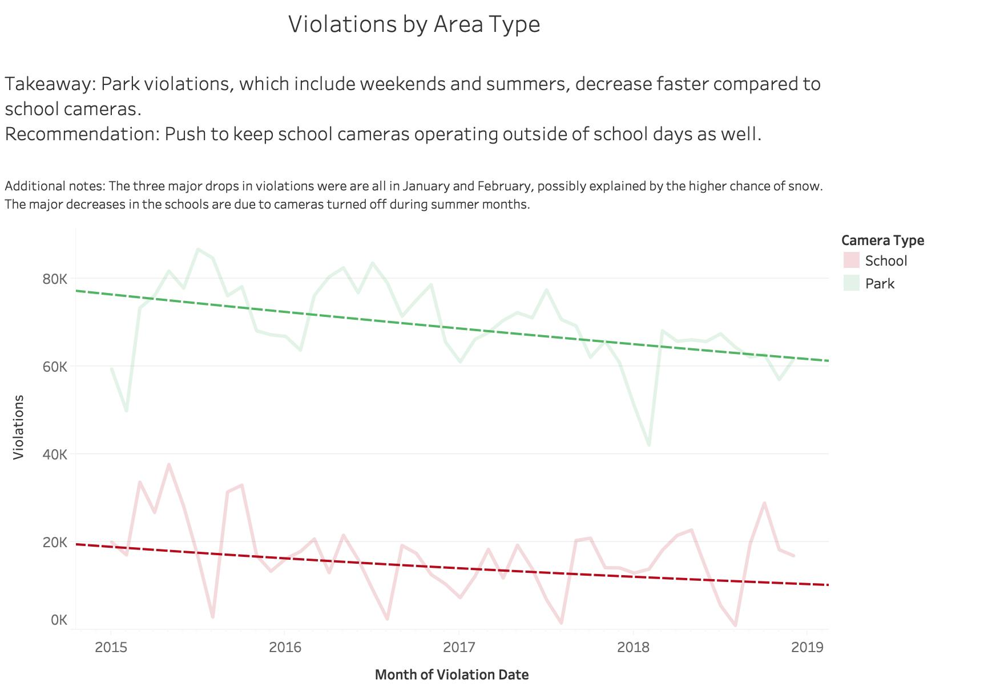
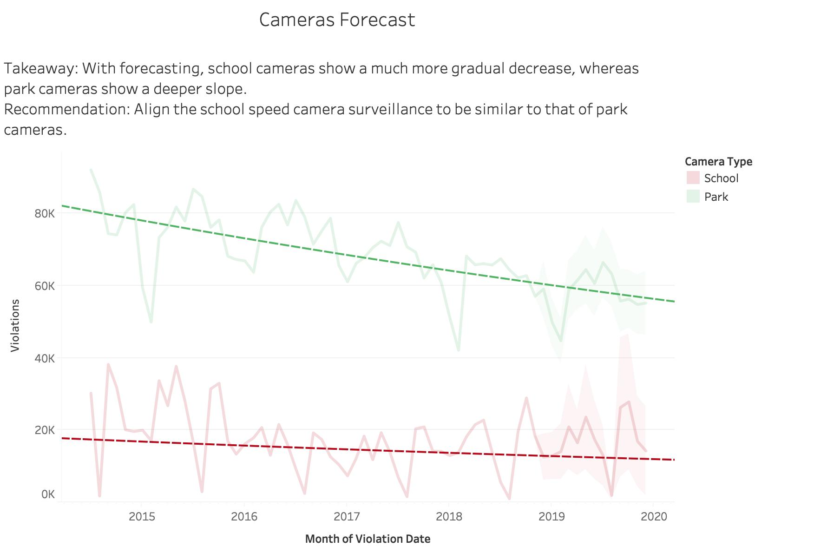
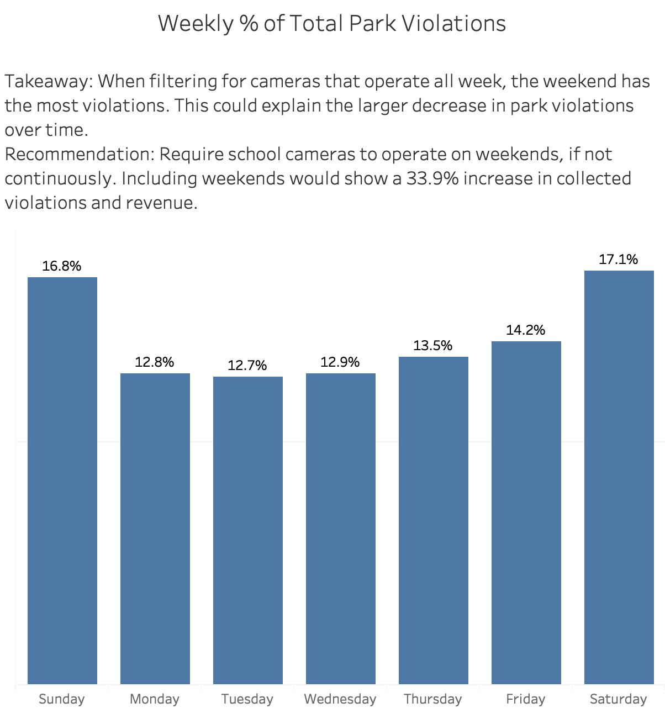

# Chicago-Speed-Violations
Visualizations based on data created from Chicago's speed violations

## First attempts:
When I first began, I was working off of my finding that the average camera violations significantly rose during the summer. Eventually I realized this was due to the number of active cameras dropping each summer and I began working with this as my interesting finding. As I investigated, I read the data explanation that included the implementation of the [speed cameras](https://www.chicago.gov/city/en/depts/cdot/supp_info/children_s_safetyzoneporgramautomaticspeedenforcement.html).
This included the explanation that when these cameras were added, the citizens allowed it on the condition that the cameras were turned off on days class did not meet including Saturdays, Sundays, and most of the summer. This explained my finding, however it meant that it was in no way interesting and wouldn't be worth the Rahm Emanuel's time.
While this meant I didn't have my visualization, it did lead me on a road to my eventual findings. I decided I could look into the differences between the cameras that were turned off during the weekend, and those that were left on. This would differentiate parks and schools. To do this I had to play around with the data in excel:
First, I was exploring how to isolate which days of the week specific cameras were available. My initial attempt was by downloading a date and day dataset and using VLOOKUP to match days of the week. I realized this was unnecessary when I found I could simply use the function =TEXT([date cell #],"dddd"), creating a new column with the weekdays. Next, I filtered the weekday column by Saturday and Sunday to find the camera IDs that were not associated with schools. I copied the relevant IDs over to a new sheet and removed duplicates. In the column alongside the camera IDs, I put a "1". Back on the unfiltered main dataset, I used VLOOKUP on a new column "Park Dummy" and every camera ID that operated on a weekend at some point was given a "1". I filtered and put a "0" under all others. The reason for all these steps was my difficulty in marking park cameras while they were operating Monday-Friday. Eventually, I replaced "1" with "Park" and "0" with "School" and I had another insightful column which I renamed “Day of Week”.

### Visualization 1:
My visualizations began by playing around with the differences between parks and schools. It quickly led me to my first finding that park violations were declining at a quicker rate than schools. I also wanted to clearly point out the trendline, so I made the data line opaque for emphasis.

### Visualization 2:
I enjoyed the results I found with how parks make a difference compared to schools so I took it a step further and added a forecast to see if it highlights the effect, and it certainly did. I added a similar format here to emphasize the trendline.

### Visualization 3:
My final visualization is mostly meant to drive home the point of my graphs. I filtered for parks to show there is a clear difference for parks in weekends vs weekdays. Allowing cameras to be off in school zones on weekends is enabling violators on the worst days.

I summed the total violations, the weekday violations, and the weekend violations and used simple math to come up with the fact that weekends have 28% higher average violations.

## Roadmap

I'm very happy with how my findings have turned out so far. I might be able to improve further on what concrete changes might occur with keeping cameras on during weekends in school zones.
It is also possible that I could find other ways to represent exactly what is happening and why there is such a significant difference between parks and schools.
